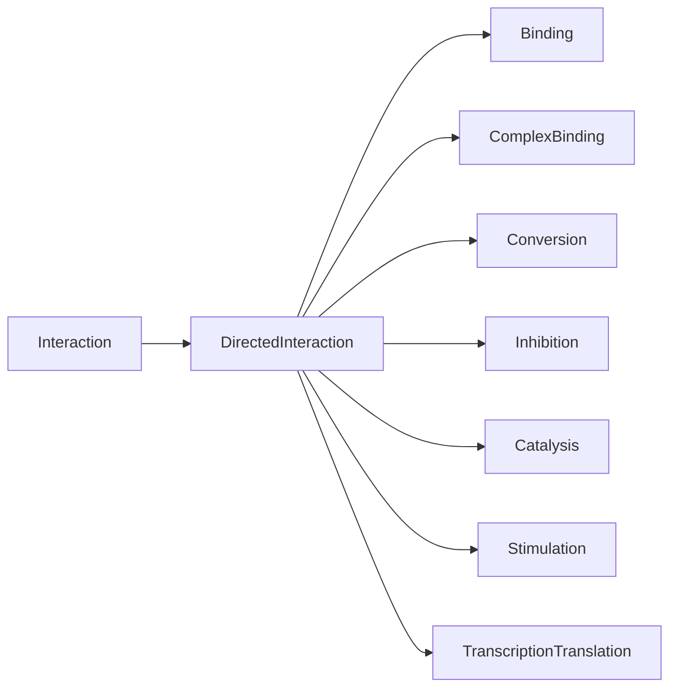
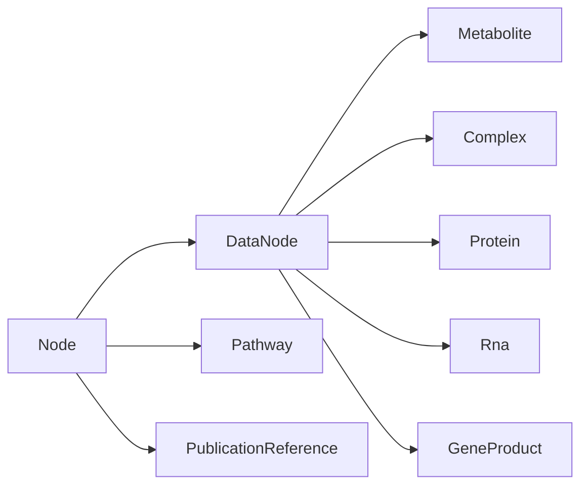

# BioDB Notes
## WikiPathways
### Interactions Schema in Parsed `ttl` Files

```mermaid
graph LR;
    Interaction --> DirectedInteraction;
    DirectedInteraction --> Binding;
    DirectedInteraction --> ComplexBinding;
    DirectedInteraction --> Conversion;
    DirectedInteraction --> Inhibition;
    DirectedInteraction --> Catalysis;
    DirectedInteraction --> Stimulation;
    DirectedInteraction --> TranscriptionTranslation;
```

### Node Schema in Parsed `ttl` Files

```mermaid
graph LR;
    Node --> DataNode;
    DataNode --> Metabolite;
    DataNode --> Complex;
    DataNode --> Protein;
    DataNode --> Rna;
    DataNode --> GeneProduct;
    Node --> Pathway;
    Node --> PublicationReference;
```